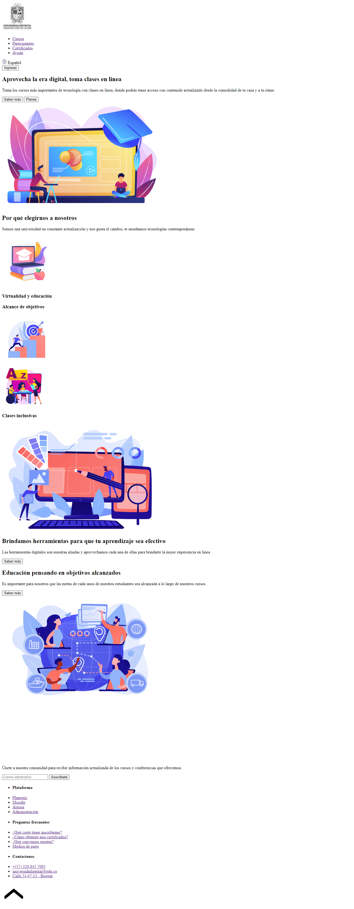
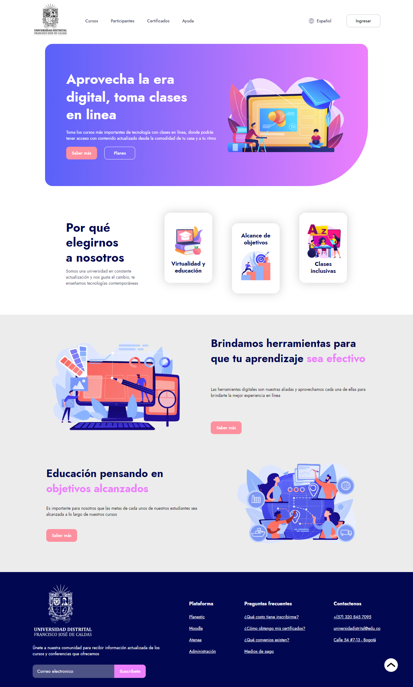
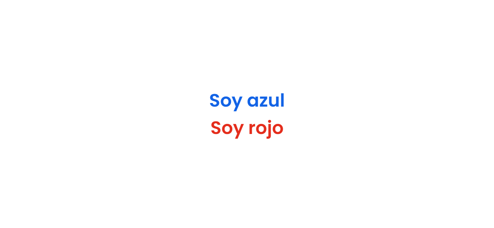
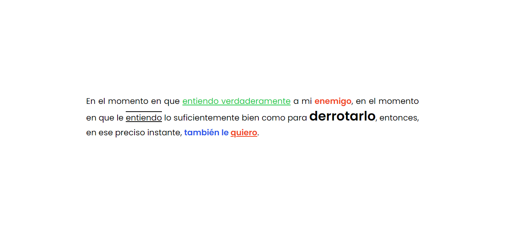
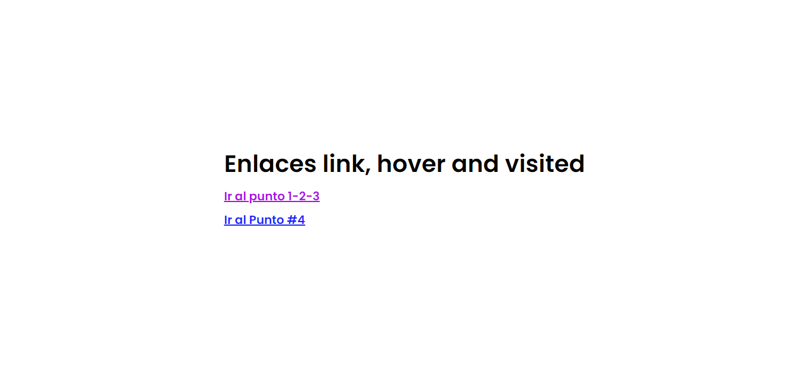
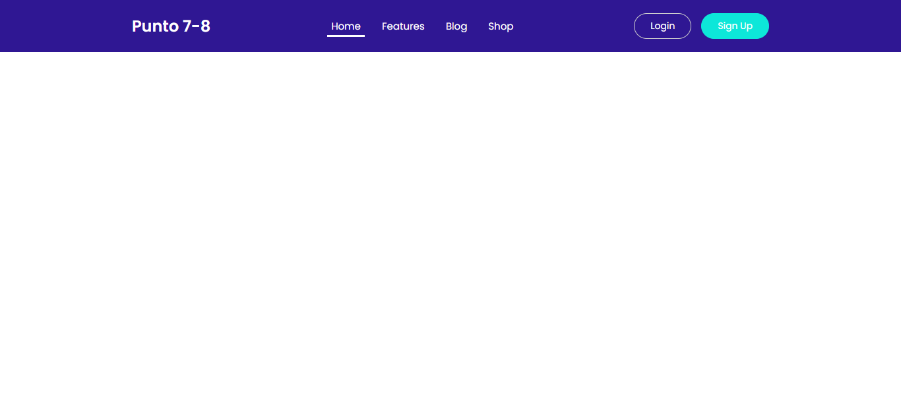

<h1>Taller 9 - Johan Stick Rodriguez Rodriguez</h1>

<h2>Información</h2>

Curso: Full Stack Basico - Grupo 1

Profesor: Cristian Patiño

<h2>Link de la pagina</h2>
<a href="https://johst03.github.io/taller-9-full-stack/">Link pagina web</a>

<h2>Punto 1: Link de Figma</h2>
<a href="https://www.figma.com/file/ArE5mDvAhi0wBTxIeaXulN/Johan-Stick-Rodriguez-Rodriguez?type=design&node-id=0%3A1&mode=design&t=TTiN5QhyNASURSHb-1">Link de Figma</a>

<h2>Punto 2: Diseño en HTML</h2>

<h2>Punto 3: Diseño en CSS</h2>

<h2>Punto 4: Titulos</h2>

<h2>Punto 5: Parrafo</h2>

<h2>Punto 6: Links</h2>

<h2>Punto 7 y 8: Titulos</h2>

<h2>Punto 9: Tabla</h2>